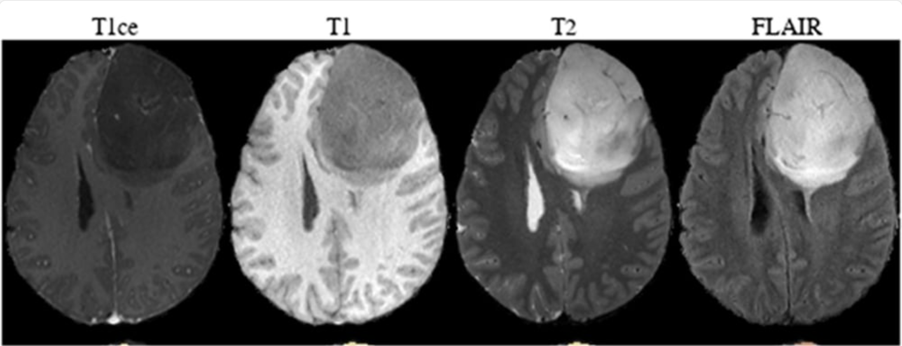
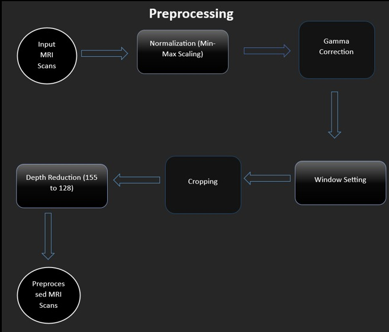
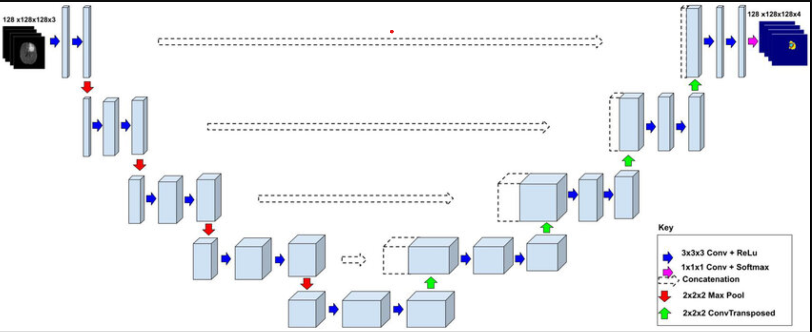
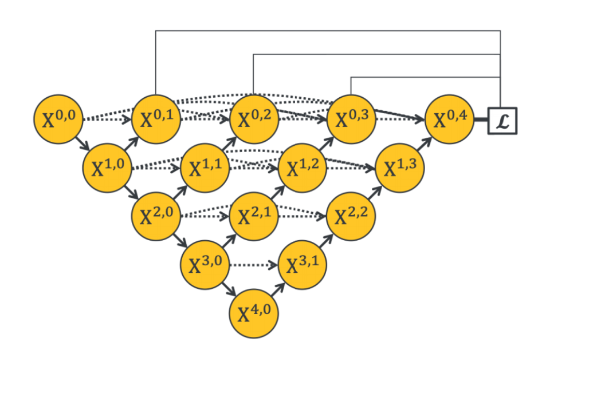
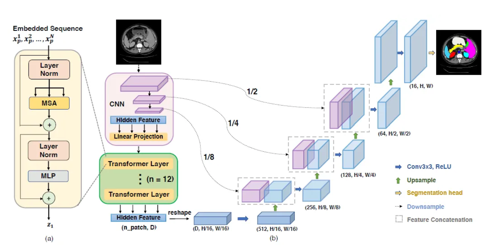

# Brain Tumor Segmentation Using Advanced Architectures

## 1. Overview
This project implements segmentation models for brain tumor detection (Complete and Core Tumors) using advanced architectures like U-Net, U-Net++, V-Net, Swin-UNet, and TransUNet, leveraging multimodal MRI datasets.

---

### 1-1) About
The project addresses the need for precise brain tumor segmentation, which aids in early detection and diagnosis. Using BraTS datasets, the segmentation focuses on gliomas that are heterogeneous in shape, appearance, and histology. The models predict tumor regions and explore radiomic features for survival analysis. Key highlights include:

- Advanced deep learning models for tumor segmentation.
- Integration with patient-centric data pipelines for prediction.

---

## 2. Dataset
### 2-1) Overview
**Dataset:** BraTS 2020  
**Data Type:** Multimodal MRI Dataset  
**Format:** `.nii.gz`  
**Shape:** `240x240x155x4` (Image) and `240x240x155` (Label)  
**Modes:**  
- **Channel 0:** T1-weighted imaging (T1)  
- **Channel 1:** T1-contrast enhanced (T1-CE)  
- **Channel 2:** T2-weighted imaging (T2)  
- **Channel 3:** FLAIR  

**Labels:**  
- **0:** Background  
- **1:** Necrotic and Non-enhancing Tumor  
- **2:** Edema  
- **3:** Enhancing Tumor  

---

### 2-2) Data Preprocessing  
The preprocessing pipeline prepares the input MRI scans for training and testing by ensuring consistent data representation and improving image quality. The steps involved are as follows:

1. **Input MRI Scans**: Multimodal MRI scans are taken as input, including T1, T2, FLAIR, and T1-contrast modalities.  
2. **Normalization (Min-Max Scaling)**: Pixel intensities are scaled to the range [0, 1] for uniform representation.  
3. **Gamma Correction**: Enhances image contrast by applying gamma adjustment, making features more distinguishable.  
4. **Window Setting**: Applies intensity thresholding to focus on relevant intensity ranges for better segmentation results.  
5. **Cropping**: Removes unnecessary borders and resizes the images to focus on the region of interest.  
6. **Depth Reduction**: Reduces the depth dimension of the MRI scans from 155 slices to 128 slices for computational efficiency.  
7. **Preprocessed MRI Scans**: The resulting scans are preprocessed, cleaned, and ready for input into the segmentation model.
- **Figure:**  

---

## 3. Model Architectures  

### 3-1) U-Net, U-Net++, V-Net, Swin-UNet, TransUNet  

The implemented models include advanced architectures optimized for 3D segmentation. For each architecture, a visual representation is provided below:  

---

#### U-Net  
- **Description:** Baseline 3D U-Net model for segmentation.  
- **Figure:**  

---

#### U-Net++  
- **Description:** Improved U-Net with dense skip connections for better feature fusion and multi-scale feature extraction.  
- **Figure:**  

---

#### V-Net  
- **Description:** Fully convolutional 3D network, designed specifically for volumetric segmentation tasks.  
- **Figure:**  

---

#### Swin-UNet  
- **Description:** Transformer-based hybrid model combining convolutional and attention mechanisms for precise segmentation.  
- **Figure:**  

---

#### TransUNet  
- **Description:** Combines transformers with the U-Net architecture for effective feature extraction and reconstruction in medical image segmentation.  
 
---

## 4. Testing and Validation
### 4-1) Testing Framework
- Evaluation of MRI inputs using ground truth comparisons.
- Metrics: Dice Coefficient, IoU, Recall, Precision.
**Figure:** 

**Figure:** 

---

## 5. Results
### 5-1) Predictions
Visual examples of segmentation results for complete and core tumors.

| **Case 1** | **Case 2** |
|-------------------|----------------|
| 
 | 
 |

### 5-2) Metrics
| **Metric**    | **Value (3D U-Net)** | **Value (Swin-UNet)** | **Value (TransUNet)** |
|---------------|-----------------------|-----------------------|-----------------------|
| Dice Score    | 0.92                 | 0.95                 | 0.96                 |
| IoU           | 0.88                 | 0.93                 | 0.94                 |
| Recall        | 0.90                 | 0.94                 | 0.95                 |
| Accuracy      | 0.984                | 0.985                | 0.986                |

---

## 6. References
- [BraTS 2020 Dataset](https://www.med.upenn.edu/cbica/brats2020/)  
- [3D U-Net Paper](https://arxiv.org/abs/1606.06650)  
- [Swin-UNet Paper](https://arxiv.org/abs/2105.05537)  
- [TransUNet Paper](https://arxiv.org/abs/2102.04306)  

